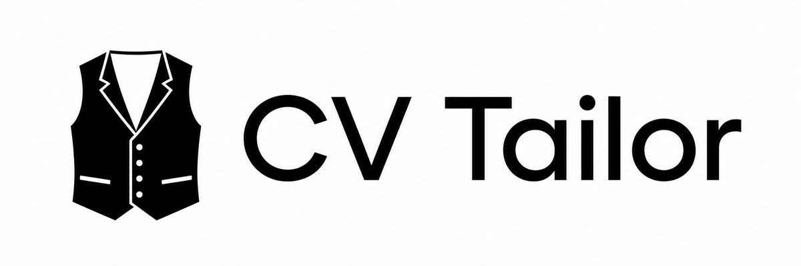
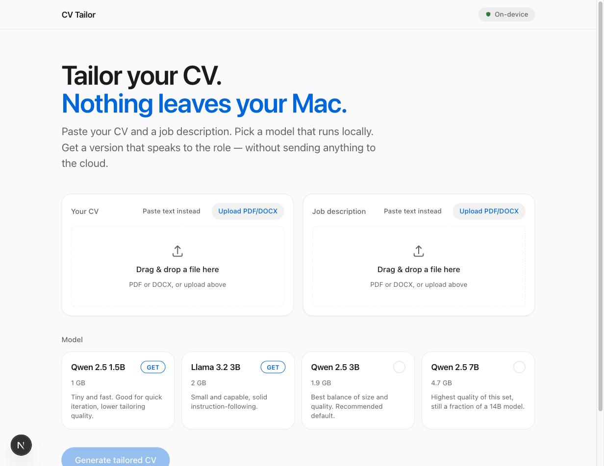
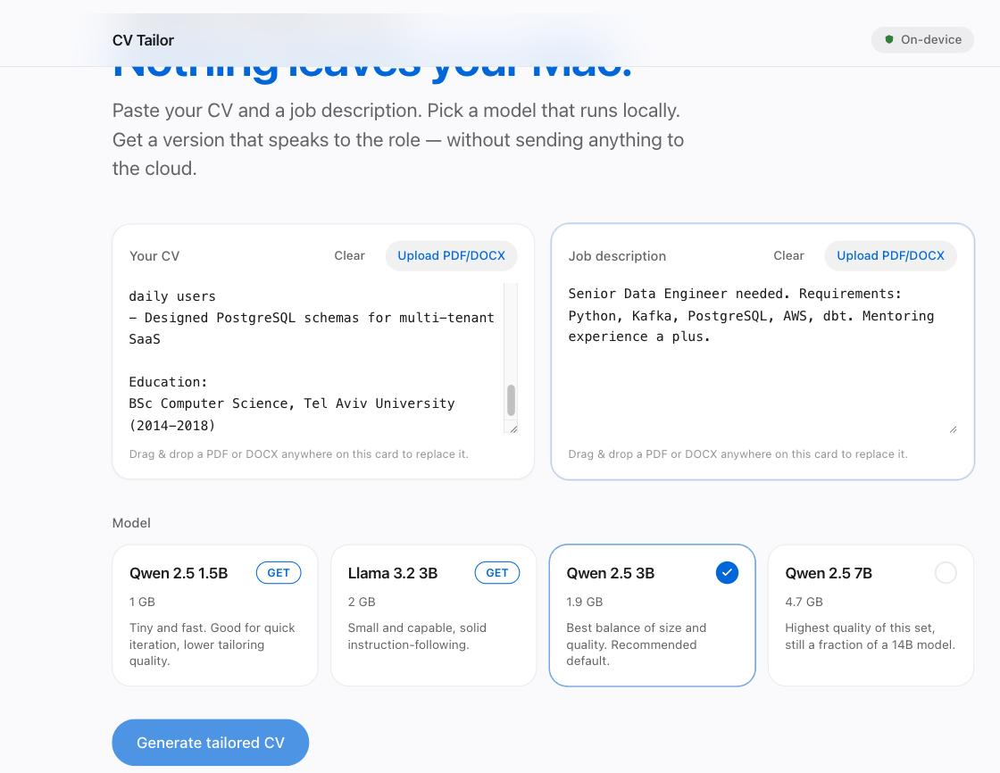
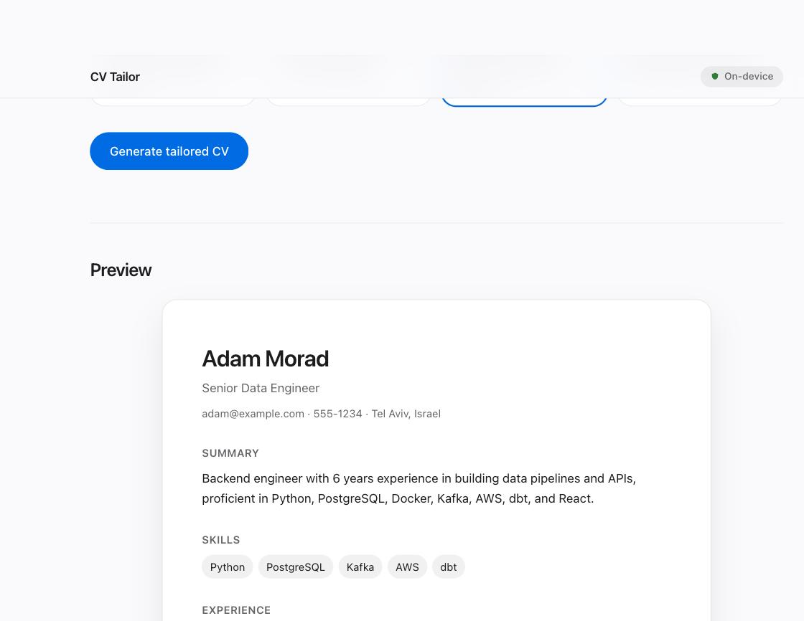

<p align="center">
  
</p>

A localhost app that tailors your CV to a job description — entirely on your own machine, using a local model through [Ollama](https://ollama.com). No API key, no cloud, nothing leaves your computer.

Paste or upload (PDF/DOCX) your CV and a job description, pick a local model, and get back a tailored CV you can export as Markdown, plain text, HTML, Word (.docx), or PDF.

## Screenshots

**Paste or upload your CV and the job description**


**Pick a local model — only the one you choose gets downloaded**


**Get a tailored preview, ready to export**


## How it works

1. **Extraction** — uploaded PDF/DOCX files are converted to plain text locally (`unpdf`, `mammoth`).
2. **Generation** — a single call to your local Ollama model returns one structured JSON representation of the CV (name, summary, skills, experience, education, ...), constrained by a JSON schema. The model reorders and rewrites your existing skills/summary/bullets to match the job description — it's instructed not to invent experience you don't have.
3. **Export** — all five output formats are rendered deterministically from that one JSON object, so they never drift from each other.

There's no agent loop, no tool-calling, no multi-step pipeline — just one prompt-in/JSON-out call per generation.

## Requirements

- Node.js 20+
- [Ollama](https://ollama.com) installed and running (`ollama serve`)

You don't need to pre-pull a model — the model picker in the UI lists a few curated, small-footprint options (Qwen 2.5 1.5B/3B/7B, Llama 3.2 3B — 1GB to 4.7GB) and downloads whichever one you pick, with a progress indicator, the first time you select it.

### Choosing a model

Local models need roughly their own size in RAM to run comfortably, on top of whatever your OS and other apps are already using. As a rule of thumb, based on your machine's total RAM:

| RAM   | Recommended                 | Notes                                                           |
| ----- | --------------------------- | --------------------------------------------------------------- |
| 8GB   | Qwen 2.5 1.5B               | Leaves headroom for everything else running                     |
| 16GB  | Qwen 2.5 3B or Llama 3.2 3B | Comfortable; Qwen 2.5 7B will work but is tight                 |
| 32GB+ | Qwen 2.5 7B                 | The highest-quality option in this app, runs with room to spare |

Apple Silicon (M-series) Macs handle all four options well thanks to fast unified memory; on Intel Macs or slower GPUs, expect generation to take noticeably longer regardless of size. If you have the RAM and want a bigger model than the curated list offers, `ollama pull` any model yourself and add it to the list in `lib/models.ts`.

## Getting started

```bash
npm install
npm run dev
```

Open [http://localhost:3000](http://localhost:3000) (or whatever port the dev server prints).

## Tech stack

Next.js (App Router) · TypeScript · Tailwind CSS · Ollama · Zod · `docx` · `pdfmake` · `unpdf` · `mammoth`

## Cleaning up

The app itself is just a Node project — deleting the `cv-tailor` folder removes it entirely. The models it downloaded live in Ollama's own data directory, separate from the app, so they need their own cleanup:

**Remove just the models this app pulled** (keeps Ollama installed for other uses):

```bash
ollama list                 # see what's installed
ollama rm qwen2.5:1.5b      # remove one by name
ollama rm llama3.2:3b qwen2.5:3b qwen2.5:7b   # or several at once
```

**Remove every model Ollama has** (still keeps Ollama itself installed):

```bash
ollama list | tail -n +2 | awk '{print $1}' | xargs -n1 ollama rm
```

**Uninstall Ollama entirely** (macOS, if you don't need it for anything else): quit it from the menu bar, then:

```bash
sudo rm -rf /Applications/Ollama.app
rm -rf ~/.ollama                                              # models + config, can be tens of GB
rm -rf ~/Library/Application\ Support/Ollama
```

## Changelog

See [CHANGELOG.md](./CHANGELOG.md) for release notes.

## Star History

[](https://star-history.com/#adamorad/cv-tailor&Date)

## License

MIT — see [LICENSE](./LICENSE).
